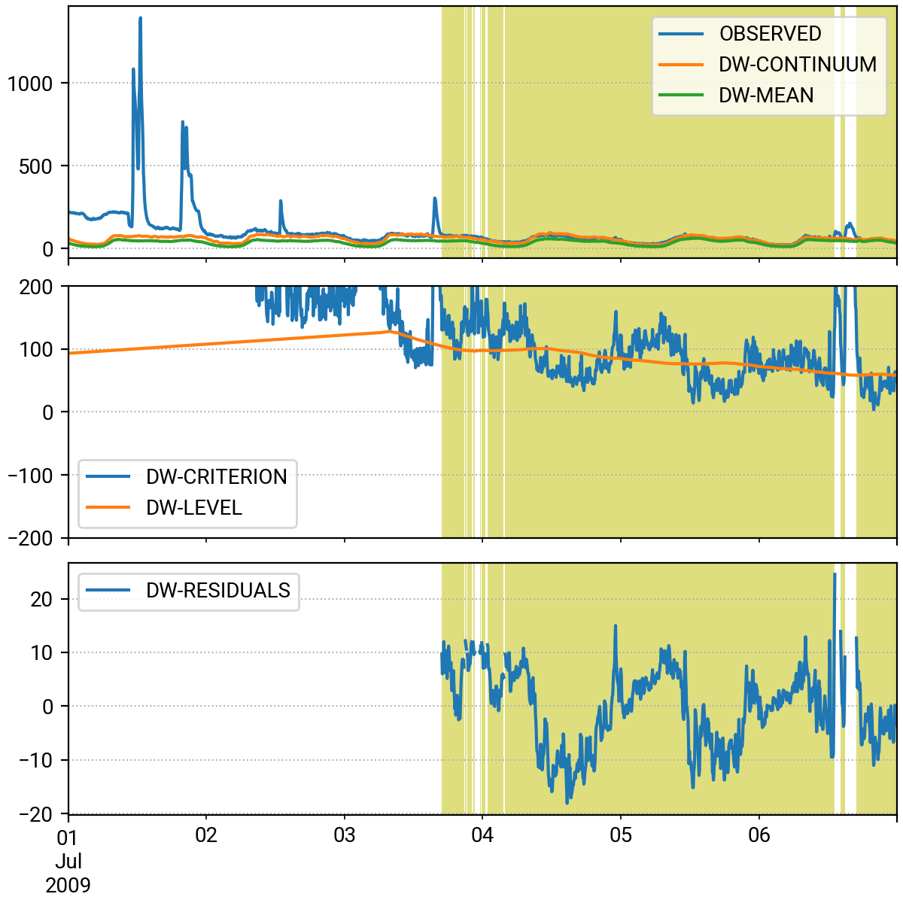

# Combined Sewer Analysis

This is a companion repository for the research article "Decomposition of Dry- and Wet-Weather Flows in Combined Sewer Measurements" by Pichler & Muschalla (2026).

The paper is submitted to publish and will be linked as soon as it is published.

```python
import pandas as pd
from combined_sewer_analysis import AnalyseData

# long term high resolution flow-rate or load-rate time series of combined sewer observations.
ts = pd.Series(index=pd.DatetimeIndex(...), data=...)
csa = AnalyseData(ts)

fig, ax = csa.get_interim_figure(slice('2009-07-01', '2009-07-06'))
fig.savefig("example_figure.png")
```

